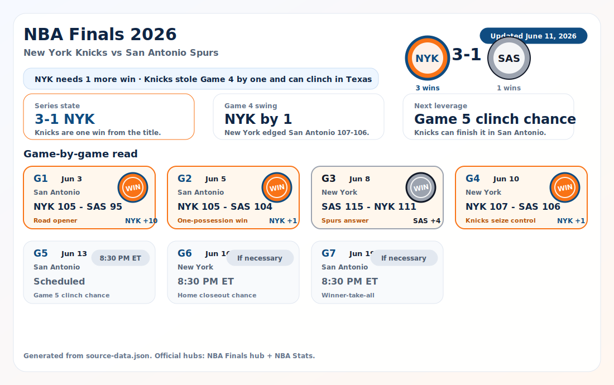
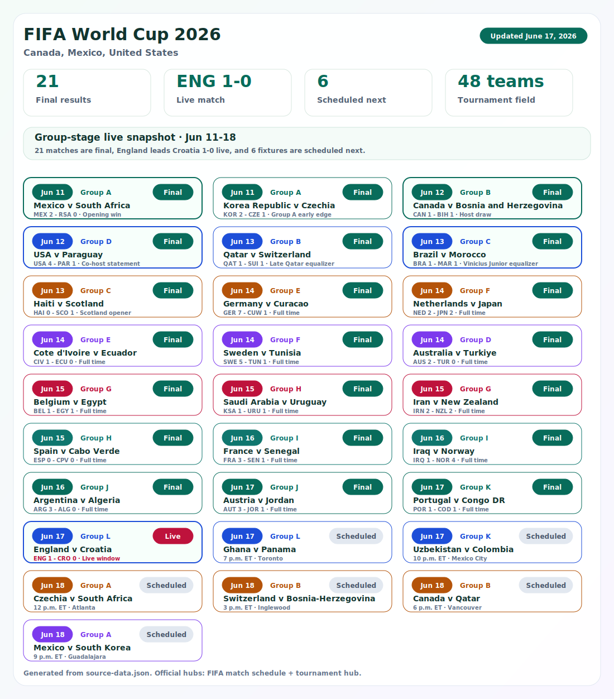

# Awesome Sports AI

A resource-type-first awesome list for Sports & AI builders who need high-signal tools, datasets, libraries, models, benchmarks, and runnable prototypes.

This repository follows the [Awesome List](https://github.com/sindresorhus/awesome) style: entries should be useful, specific, reachable, neutral, and grouped into one canonical category.

This README is the human-readable directory. [`data/catalog.json`](data/catalog.json) is the machine-readable source of truth for categories, sport tags, AI capabilities, openness labels, tools, and builder recipes. README entries use this metadata pattern: `_Sports: ... . AI: ... . Access: ... ._`

## Quick Start for Builders

- Need runnable code? Start with [Open-Source Projects](#open-source-projects), especially [`llm-match-commentator`](prototypes/llm-match-commentator/), [`wnba-gravity-mapper`](prototypes/wnba-gravity-mapper/), and [`pickleball-court-mapper`](prototypes/pickleball-court-mapper/).
- Need raw material? Start with [Datasets/APIs/Feeds](#datasetsapisfeeds).
- Need implementation building blocks? Start with [Developer Libraries/SDKs](#developer-librariessdks) and [AI Models/Components](#ai-modelscomponents).
- Need evaluation references? Start with [Research Benchmarks](#research-benchmarks).
- Need event or demo context? Start with [Event Toolkits](#event-toolkits) and [Builder Recipes](#builder-recipes).
- **Contribute:** [CONTRIBUTING.md](CONTRIBUTING.md) - or pick a [`good first issue`](https://github.com/moose-lab/awesome-sports-ai/issues?q=is%3Aissue+is%3Aopen+label%3A%22good+first+issue%22).

## Vibe-Coding Lookup Paths

Use these paths when you want to move from idea to working prototype quickly:

- Match commentary app: [`llm-match-commentator`](prototypes/llm-match-commentator/) + [OpenAI Whisper](#ai-modelscomponents) + [StatsBomb Open Data](#datasetsapisfeeds).
- Basketball spacing tool: [`wnba-gravity-mapper`](prototypes/wnba-gravity-mapper/) + [Metrica Sports Sample Data](#datasetsapisfeeds) + [sportypy](#developer-librariessdks).
- Court vision prototype: [`pickleball-court-mapper`](prototypes/pickleball-court-mapper/) + [OpenCV](#developer-librariessdks) + [Roboflow Sports](#ai-modelscomponents).
- Soccer analytics report: [StatsBomb Open Data](#datasetsapisfeeds) + [socceraction](#developer-librariessdks) + [mplsoccer](#developer-librariessdks).
- Tournament operations assistant: [Challonge API](#datasetsapisfeeds) + [Competition Factory](#open-source-projects) + [SportsEngine Tourney](#apps-products).

## Sports & AI Relevance Rule

Every entry should connect a sport-specific workflow to AI, data, automation, video, modeling, benchmarking, or developer infrastructure. Generic tools belong here only when they unlock a clear sports AI use case.

Open-source projects, open datasets, open APIs, reproducible research, and free developer paths should lead each category. Commercial systems can stay when they help builders understand the professional reference point, but they should be labeled `commercial-reference`.

## How To Use This Directory

Use resource type first, then narrow by sport, AI capability, and openness. The catalog is organized this way so a developer can quickly answer: "Do I need an app reference, source data, a library, a model component, a benchmark, or a runnable prototype?"

Promotion-friendly description: Awesome Sports AI is a resource-type-first awesome list for developers building sports AI tools with open code, public data, reproducible references, and compact prototype paths.

## Resource-Type Directory

### Apps & Products

- <!-- catalog:sports-ai-hub --> [Sports AI Hub](https://sports-ai-hub.pages.dev/) - Provides the public web app companion for this directory, including builder navigation, prototypes, and project paths. _Sports: Multi-sport. AI: Operations, data ingestion. Access: open-source._
- <!-- catalog:stonk-striker --> [Stonk Striker](https://stonk-striker.vercel.app/) - Turns stock and crypto price charts into a browser football striking game with market-shaped terrain. _Sports: Soccer. AI: Media generation, analytics/modeling. Access: free-dev-tier._
- <!-- catalog:fantasy-manager --> [fantasy-manager](https://github.com/lukasdotcom/fantasy-manager) - Provides an open-source self-hosted fantasy manager. _Sports: Multi-sport. AI: Operations, analytics/modeling. Access: open-source._
- <!-- catalog:sportsengine-tourney --> [SportsEngine Tourney](https://www.sportsengine.com/tourney/) - Manages tournament scheduling, brackets, standings, score updates, registration, and team communication. _Sports: Multi-sport. AI: Operations. Access: commercial-reference._
- <!-- catalog:second-spectrum --> [Second Spectrum](https://www.geniussports.com/newsroom/genius-sports-second-spectrum-tracking-technology-approved-by-fifa-quality-programme-for-epts/) - Provides optical tracking, tactical analytics, and augmented broadcast tools for professional leagues and teams. _Sports: Basketball, Soccer. AI: Tracking, analytics/modeling, media generation. Access: commercial-reference._

### Open-Source Projects

- <!-- catalog:llm-match-commentator --> [`llm-match-commentator`](prototypes/llm-match-commentator/) - Generates localized match commentary from structured event streams. `python3 commentator.py` _Sports: Soccer, Multi-sport. AI: LLM/NLP, media generation. Access: open-source._
- <!-- catalog:wnba-gravity-mapper --> [`wnba-gravity-mapper`](prototypes/wnba-gravity-mapper/) - Calculates player gravity from basketball tracking coordinates and renders a heatmap. `python3 gravity_mapper.py` _Sports: Basketball. AI: Tracking, analytics/modeling. Access: open-source._
- <!-- catalog:pickleball-court-mapper --> [`pickleball-court-mapper`](prototypes/pickleball-court-mapper/) - Detects pickleball court lines and generates annotated court diagrams. `python3 court_mapper.py` _Sports: Tennis/Racquet. AI: Computer vision, tracking. Access: open-source._
- <!-- catalog:football-match-intelligence --> [football-match-intelligence](https://github.com/DataKnight1/football-match-intelligence) - Builds football match intelligence dashboards with pitch control, sprint efficiency, and tactical sequencing. _Sports: Soccer. AI: Analytics/modeling, tracking. Access: open-source._
- <!-- catalog:soccer-video-analytics --> [soccer-video-analytics](https://github.com/tryolabs/soccer-video-analytics) - Demonstrates automatic soccer ball possession analysis from video. _Sports: Soccer. AI: Computer vision, tracking. Access: open-source._
- <!-- catalog:video-tagging-events --> [Video Tagging Events](https://github.com/napo/videotaggingevents) - Tags specific segments of a video for sports review and analysis. _Sports: Multi-sport. AI: Operations, media generation. Access: open-source._
- <!-- catalog:athlete-load-monitor --> [AthleteLoadMonitor](https://github.com/SaxionAMI/AthleteLoadMonitor) - Monitors and predicts athlete load for team-sport coaches. _Sports: Multi-sport. AI: Training load, analytics/modeling. Access: open-source._
- <!-- catalog:coroebus --> [Coroebus](https://github.com/prakashsellathurai/Coroebus) - Tracks training load, fitness, fatigue, and readiness for athletes. _Sports: Multi-sport. AI: Training load, analytics/modeling. Access: open-source._
- <!-- catalog:bracket --> [bracket](https://github.com/evroon/bracket) - Provides a self-hosted tournament system for creating and managing brackets. _Sports: Multi-sport. AI: Operations. Access: open-source._
- <!-- catalog:competition-factory --> [Competition Factory](https://github.com/CourtHive/competition-factory) - Manipulates tournament and league documents, including draws and competition structures. _Sports: Tennis/Racquet, Multi-sport. AI: Operations, data ingestion. Access: open-source._
- <!-- catalog:ready2race --> [Ready2Race](https://github.com/lambda9-gmbh/ready2race) - Plans and executes competition events such as coastal rowing races. _Sports: Multi-sport. AI: Operations. Access: open-source._
- <!-- catalog:fantasy-football-wrapped --> [fantasy-football-wrapped](https://github.com/kt474/fantasy-football-wrapped) - Generates fantasy league insights and charts for Sleeper and ESPN leagues. _Sports: American Football. AI: Analytics/modeling, media generation. Access: open-source._
- <!-- catalog:football-scout-rag --> [football_scout_rag](https://github.com/yotambraun/football_scout_rag) - Generates repeatable football player scouting reports with retrieval-augmented workflows. _Sports: Soccer. AI: LLM/NLP, analytics/modeling. Access: open-source._

### Datasets/APIs/Feeds

- <!-- catalog:balldontlie --> [balldontlie](https://www.balldontlie.io/) - Provides API access to basketball teams, players, games, and box-score data. _Sports: Basketball. AI: Data ingestion. Access: open-api._
- <!-- catalog:collegefootballdata --> [CollegeFootballData](https://collegefootballdata.com/) - Provides college football API endpoints for games, drives, plays, rankings, ratings, and recruiting data. _Sports: American Football. AI: Data ingestion, analytics/modeling. Access: open-api._
- <!-- catalog:football-json --> [football.json](https://github.com/openfootball/football.json) - Provides public-domain football match data in JSON for schedules, leagues, clubs, and results. _Sports: Soccer. AI: Data ingestion. Access: open-data._
- <!-- catalog:statsbomb-open-data --> [StatsBomb Open Data](https://github.com/statsbomb/open-data) - Provides free soccer event data for public analysis and modeling. _Sports: Soccer. AI: Data ingestion, benchmarking. Access: open-data._
- <!-- catalog:metrica-sports-sample-data --> [Metrica Sports Sample Data](https://github.com/metrica-sports/sample-data) - Provides sample soccer tracking and event data for analytics tutorials and reproducible analysis. _Sports: Soccer. AI: Data ingestion, tracking. Access: open-data._
- <!-- catalog:dynastyprocess-data --> [dynastyprocess/data](https://github.com/dynastyprocess/data) - Provides open fantasy football data maintained by DynastyProcess. _Sports: American Football. AI: Data ingestion, analytics/modeling. Access: open-data._
- <!-- catalog:challonge-api --> [Challonge API](https://api.challonge.com/) - Lets developers create tournaments, update brackets, and report scores programmatically. _Sports: Multi-sport. AI: Operations, data ingestion. Access: open-api._
- <!-- catalog:toornament-api --> [Toornament API](https://developer.toornament.com/) - Provides APIs for building tournament, match, calendar, ranking, and registration workflows. _Sports: Esports, Multi-sport. AI: Operations, data ingestion. Access: open-api._
- <!-- catalog:nba-api --> [nba_api](https://github.com/swar/nba_api) - Provides a Python client for NBA.com stats endpoints and basketball data workflows. _Sports: Basketball. AI: Data ingestion. Access: open-source._

### Developer Libraries/SDKs

- <!-- catalog:fastf1 --> [FastF1](https://github.com/theOehrly/Fast-F1) - Loads Formula 1 timing, telemetry, session, schedule, and weather data in Python. _Sports: Motorsport. AI: Data ingestion, analytics/modeling. Access: open-source._
- <!-- catalog:kloppy --> [Kloppy](https://github.com/PySport/kloppy) - Standardizes soccer tracking and event data into vendor-independent Python objects. _Sports: Soccer. AI: Data ingestion, tracking. Access: open-source._
- <!-- catalog:statsbombpy --> [statsbombpy](https://github.com/statsbomb/statsbombpy) - Streams StatsBomb soccer data into Python for analysis and modeling. _Sports: Soccer. AI: Data ingestion, analytics/modeling. Access: open-source._
- <!-- catalog:mplsoccer --> [mplsoccer](https://github.com/andrewRowlinson/mplsoccer) - Draws soccer pitches and common football analytics plots with Matplotlib. _Sports: Soccer. AI: Analytics/modeling, media generation. Access: open-source._
- <!-- catalog:socceraction --> [socceraction](https://github.com/ML-KULeuven/socceraction) - Converts soccer event streams to SPADL and values actions with VAEP or xT. _Sports: Soccer. AI: Data ingestion, analytics/modeling. Access: open-source._
- <!-- catalog:soccerplots --> [soccerplots](https://github.com/slothfulwave/soccerplots) - Creates radar and pizza charts for football player analysis. _Sports: Soccer. AI: Analytics/modeling, media generation. Access: open-source._
- <!-- catalog:sportypy --> [sportypy](https://github.com/sportsdataverse/sportypy) - Draws regulation playing surfaces for several sports in Python. _Sports: Multi-sport. AI: Analytics/modeling, media generation. Access: open-source._
- <!-- catalog:ffmpeg-python --> [ffmpeg-python](https://github.com/kkroening/ffmpeg-python) - Provides Python bindings for FFmpeg video processing and filtering. _Sports: Multi-sport. AI: Media generation. Access: open-source._
- <!-- catalog:floodlight --> [floodlight](https://github.com/floodlight-sports/floodlight) - Provides Python data structures, parsers, and analysis models for team-sport event and tracking data. _Sports: Multi-sport. AI: Data ingestion, tracking, analytics/modeling. Access: open-source._
- <!-- catalog:opencv --> [OpenCV](https://github.com/opencv/opencv) - Provides open-source computer vision infrastructure for tracking, detection, and video analysis. _Sports: Multi-sport. AI: Computer vision, tracking. Access: open-source._
- <!-- catalog:sportsdataverse-py --> [sportsdataverse-py](https://github.com/sportsdataverse/sportsdataverse-py) - Provides a Python package for loading and tidying data from several SportsDataverse ecosystems. _Sports: Multi-sport. AI: Data ingestion, analytics/modeling. Access: open-source._
- <!-- catalog:databallpy --> [databallpy](https://github.com/Alek050/databallpy) - Reads, preprocesses, visualizes, and synchronizes soccer event and tracking data. _Sports: Soccer. AI: Data ingestion, tracking, training load. Access: open-source._
- <!-- catalog:yahoo-fantasy-sports-api-go --> [yahoo-fantasy-sports-api-go](https://github.com/n-ae/yahoo-fantasy-sports-api-go) - Provides Go bindings for Yahoo Fantasy Sports APIs. _Sports: Multi-sport. AI: Data ingestion. Access: open-source._

### AI Models/Components

- <!-- catalog:roboflow-sports --> [Roboflow Sports](https://github.com/roboflow/sports) - Provides computer-vision examples, models, and workflows for sports detection, tracking, and analytics. _Sports: Multi-sport. AI: Computer vision, tracking. Access: open-source._
- <!-- catalog:soccer-xg --> [soccer_xg](https://github.com/ML-KULeuven/soccer_xg) - Trains and analyzes expected-goals models for soccer. _Sports: Soccer. AI: Analytics/modeling. Access: open-source._
- <!-- catalog:mmpose --> [MMPose](https://github.com/open-mmlab/mmpose) - Provides an open-source pose estimation toolbox for biomechanics and movement analysis. _Sports: Multi-sport. AI: Computer vision, tracking, training load. Access: open-source._
- <!-- catalog:openpose --> [OpenPose](https://github.com/CMU-Perceptual-Computing-Lab/openpose) - Detects real-time multi-person body, hand, face, and foot keypoints. _Sports: Multi-sport. AI: Computer vision, tracking. Access: open-source._
- <!-- catalog:openai-whisper --> [OpenAI Whisper](https://github.com/openai/whisper) - Transcribes commentary, interviews, and review audio for sports media workflows. _Sports: Multi-sport. AI: LLM/NLP, media generation. Access: open-source._
- <!-- catalog:acute-chronic-workload-ratio --> [Acute_Chronic_Workload_Ratio](https://github.com/ale-uy/Acute_Chronic_Workload_Ratio) - Calculates acute-to-chronic workload ratios in Python. _Sports: Multi-sport. AI: Training load, analytics/modeling. Access: open-source._
- <!-- catalog:sports-betting --> [sports-betting](https://github.com/georgedouzas/sports-betting) - Collects sports betting AI tools and prediction experiments. _Sports: Multi-sport. AI: Analytics/modeling. Access: open-source._
- <!-- catalog:model-card-toolkit --> [Model Card Toolkit](https://github.com/tensorflow/model-card-toolkit) - Documents training data, assumptions, limitations, and evaluation results for machine learning models. _Sports: Multi-sport. AI: Benchmarking, analytics/modeling. Access: open-source._

### Research Benchmarks

- <!-- catalog:google-research-football --> [Google Research Football](https://github.com/google-research/football) - Provides a reinforcement-learning football environment for AI research. _Sports: Soccer. AI: Simulation/RL, benchmarking. Access: open-source._
- <!-- catalog:soccernet --> [SoccerNet](https://www.soccer-net.org/data) - Provides datasets and benchmarks for soccer video understanding, action spotting, tracking, and game-state reconstruction. _Sports: Soccer. AI: Computer vision, tracking, benchmarking. Access: paper-benchmark._
- <!-- catalog:sportsmot --> [SportsMOT](https://deeperaction.github.io/datasets/sportsmot.html) - Provides a multi-object tracking dataset across basketball, football, and volleyball scenes. _Sports: Basketball, Soccer, Volleyball. AI: Tracking, computer vision, benchmarking. Access: paper-benchmark._
- <!-- catalog:tacticai --> [TacticAI](https://www.nature.com/articles/s41467-024-45965-x) - Describes a football tactics assistant for predicting and generating corner-kick tactical recommendations. _Sports: Soccer. AI: Analytics/modeling, benchmarking. Access: paper-benchmark._

### Event Toolkits

- <!-- catalog:world-cup-2026-zone --> [World Cup 2026 zone plan](docs/world-cup-2026-zone.md) - Defines live stream cadence, Match Center contract, matchday zones, and operations checklist. _Sports: Soccer. AI: Operations, data ingestion. Access: open-source._
- <!-- catalog:world-cup-2026-toolkit --> [World Cup 2026 assistant toolkit](docs/world-cup-2026-toolkit.md) - Collects practical lanes for live data, match intelligence, xG, video review, scouting, and localization. _Sports: Soccer. AI: Data ingestion, analytics/modeling, LLM/NLP. Access: open-source._
- <!-- catalog:fifa-world-cup-2026-visualization --> [FIFA World Cup 2026 live score visualization](visualizations/fifa-world-cup-2026.svg) - Shows a generated World Cup 2026 live group-stage snapshot from the source data contract. _Sports: Soccer. AI: Media generation, data ingestion. Access: open-source._
- <!-- catalog:nba-finals-2026-visualization --> [NBA Finals 2026: Knicks Champions](visualizations/nba-finals-2026.svg) - Shows a generated Knicks championship snapshot with game-by-game context. _Sports: Basketball. AI: Media generation, analytics/modeling. Access: open-source._

### Learning Collections

- <!-- catalog:analytics-handbook --> [analytics-handbook](https://github.com/devinpleuler/analytics-handbook) - Introduces practical soccer analytics concepts and workflows. _Sports: Soccer. AI: Analytics/modeling. Access: open-source._
- <!-- catalog:awesome-football-analytics --> [awesome-football-analytics](https://github.com/diegopastor/awesome-football-analytics) - Curates football analytics resources, datasets, software, and learning material. _Sports: Soccer. AI: Analytics/modeling, data ingestion. Access: open-source._
- <!-- catalog:awesome-soccer-analytics --> [awesome-soccer-analytics](https://github.com/matiasmascioto/awesome-soccer-analytics) - Collects soccer analytics resources in English and Spanish. _Sports: Soccer. AI: Analytics/modeling, data ingestion. Access: open-source._
- <!-- catalog:awesome-sports-analytics --> [awesome-sports-analytics](https://github.com/AtomScott/awesome-sports-analytics) - Collects sports analytics datasets, tools, papers, and learning resources. _Sports: Multi-sport. AI: Analytics/modeling, data ingestion. Access: open-source._
- <!-- catalog:football-analytics --> [football_analytics](https://github.com/eddwebster/football_analytics) - Curates football analytics projects, data, and public resources. _Sports: Soccer. AI: Analytics/modeling, data ingestion. Access: open-source._

## Builder Recipes

Builder recipes reference catalog tools instead of duplicating tool records. The machine-readable version lives in [`data/catalog.json`](data/catalog.json).

### Build Your Own xG Model

Train and document a basic expected-goals model from public soccer event data.

Use: StatsBomb Open Data, Kloppy, mplsoccer, soccer_xg, and Model Card Toolkit.

### Build Your Own Coaching Video Tagger

Create a simple sports video tagging and coach-note workflow from user-owned footage.

Use: ffmpeg-python, Video Tagging Events, soccer-video-analytics, analytics-handbook, and OpenAI Whisper.

### Build Your Own Player Scouting Board

Combine player profiles, public data, similarity charts, clips, and reports into a lightweight scouting board.

Use: socceraction, nba_api, soccerplots, Roboflow Sports, and football_scout_rag.

### Build Your Own Athlete Load Dashboard

Parse athlete-owned workload files, calculate load ratios, flag risk, and render a training dashboard.

Use: databallpy, Kloppy, Acute_Chronic_Workload_Ratio, AthleteLoadMonitor, and Coroebus.

### Build Your Own Match Intelligence Report

Normalize fixture and event data into an automated match report with model outputs and stat cards.

Use: football_analytics, socceraction, sports-betting, mplsoccer, and football-match-intelligence.

### Build Your Own Sports AI Prototype Launch Pack

Start from runnable prototypes and event kits when you want a compact demo that can be forked, explained, and shared.

Use: llm-match-commentator, wnba-gravity-mapper, pickleball-court-mapper, and the World Cup 2026 assistant toolkit.

## Featured Event Toolkits

Generated event visuals live in [visualizations/](visualizations/). Regenerate them with `node scripts/generate-visualizations.mjs`.

Direct visualization tags: [NBA Finals 2026: Knicks Champions](visualizations/nba-finals-2026.svg) | [FIFA World Cup 2026](visualizations/fifa-world-cup-2026.svg)

### 2026 FIFA World Cup Zone

The World Cup lane is now an event toolkit rather than the whole directory. It has a source-backed live update contract, a matchday coverage structure, and a football assistant toolkit for builders supporting the 2026 Canada, Mexico, and United States tournament.

- [World Cup 2026 zone plan](docs/world-cup-2026-zone.md) - Live stream cadence, Match Center contract, matchday zones, and operations checklist.
- [World Cup 2026 assistant toolkit](docs/world-cup-2026-toolkit.md) - Practical tools for live data, match intelligence, xG, video review, scouting, and localization.
- [FIFA World Cup live visualization](visualizations/fifa-world-cup-2026.svg) - Generated from `visualizations/source-data.json`.
- [Source data contract](visualizations/source-data.json) - Fixtures, update stream metadata, matchday zones, and toolkit lanes for Sports AI Hub consumers.

### Congratulations, New York Knicks: 2026 NBA Champions!

The Knicks closed the 2026 NBA Finals 4-1 over the San Antonio Spurs with a 94-90 Game 5 win on June 13, 2026, ending a 53-year championship wait.

## Sport Tags

Entries are grouped by resource type and tagged by sport so contributors can keep one canonical placement while still making sport-specific tools easy to find.

V1 sport tags: `Soccer`, `Basketball`, `American Football`, `Baseball/Softball`, `Tennis/Racquet`, `Running/Track`, `Cycling`, `Swimming`, `Ice Hockey`, `Rugby`, `Cricket`, `Volleyball`, `Golf`, `Combat Sports`, `Motorsport`, `Esports`, `Multi-sport`.

Use `Multi-sport` for tools designed to work across many sports, generic APIs, infrastructure, visualization libraries, video tooling, and datasets not tied to one sport.

## Contribution Rules

- Add each tool to one canonical resource-type category.
- Prefer open-source projects, open datasets, open APIs, reproducible research, and tools with a free developer path.
- Keep commercial products only when they are useful references for builders and label them `commercial-reference`.
- Include visible sport, AI capability, and access metadata.
- Update [`data/catalog.json`](data/catalog.json) and README together.
- Run `node --test scripts/*.test.mjs` before opening a pull request.

## Roadmap and Project Context

Professional sports teams use expensive AI, video, tracking, scouting, and athlete-performance systems that are hard for individual builders to access. This repository decomposes those enterprise capabilities into small mono-tools the open-source community can build.

- [Enterprise-to-Open-Source Decomposition](docs/enterprise-to-open-source-decomposition.md) - Stack map and mono-tool roadmap.
- [2026 Strategic Roadmap](docs/roadmap-2026-strategy.md) - Project opportunities around the FIFA World Cup, women's sports, multimodal LLMs, and emerging sports.
- [Sports AI Hub PRD](docs/PRD-awesome-sports-ai-2026.md) - Product brief for the public Sports AI Hub direction.

## Contributing

Contributions are welcome. Please read [CONTRIBUTING.md](CONTRIBUTING.md) before opening a pull request.

## License

This list is released under [CC0 1.0 Universal](LICENSE).
