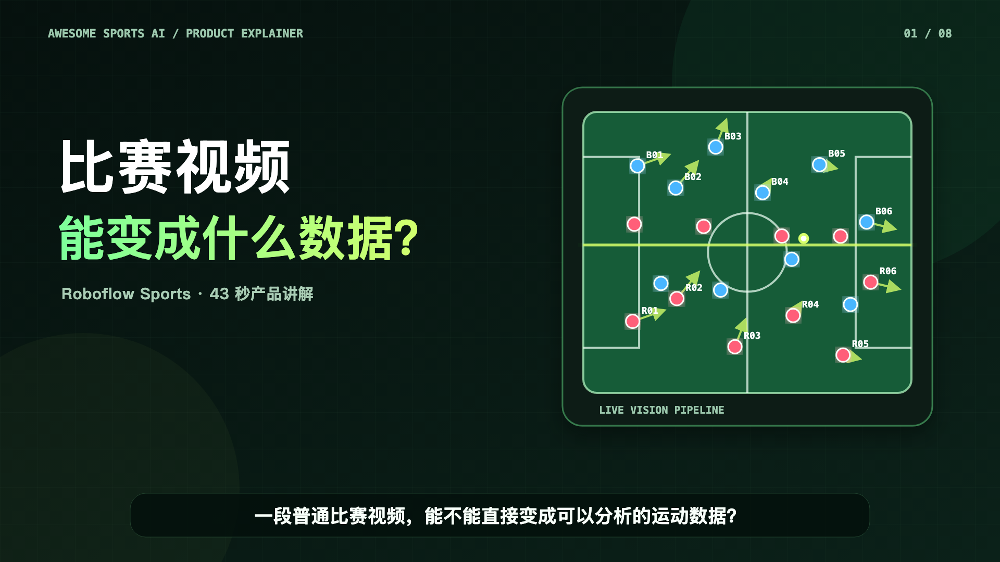

# Roboflow Sports Product Explainer

[](roboflow-sports-explainer-zh.mp4)

This 43-second Chinese product explainer introduces the open-source [`roboflow/sports`](https://github.com/roboflow/sports) project through an original vector animation. It explains the reusable workflow from video input through detection, tracking, team classification, pitch-view projection, speed, and distance analysis.

## Deliverables

- [`roboflow-sports-explainer-zh.mp4`](roboflow-sports-explainer-zh.mp4) — 1920×1080 H.264 video with Mandarin narration and burned-in Chinese captions.
- [`roboflow-sports-explainer-zh.srt`](roboflow-sports-explainer-zh.srt) — editable subtitle track.
- [`poster.png`](poster.png) and [`poster.svg`](poster.svg) — preview artwork.
- [`render.mjs`](render.mjs) — dependency-free SVG/Chrome frame renderer and FFmpeg build script.

## Re-render

Requirements: Node.js, Google Chrome or Chromium, FFmpeg, and macOS `say` with the `Tingting` voice for narration.

```bash
node docs/media/roboflow-sports-explainer/render.mjs
```

Use `--silent` to render without narration. The script creates all intermediate PNG frames in a temporary directory and removes them after export. Set `KEEP_FRAMES=1` to retain them for debugging.

## Source and media notes

The feature claims were checked against the upstream README, soccer example, and source modules for ball tracking, team classification, and view transformation. The animation does not redistribute match footage from the upstream demos; every visual in the MP4 is an original vector reconstruction of the documented workflow. See the [official upstream demo](https://github.com/roboflow/sports#-demos) for real output footage.

The upstream project code is MIT licensed. Its soccer example also uses models and dependencies with their own licenses, so downstream builders should review those separately.
