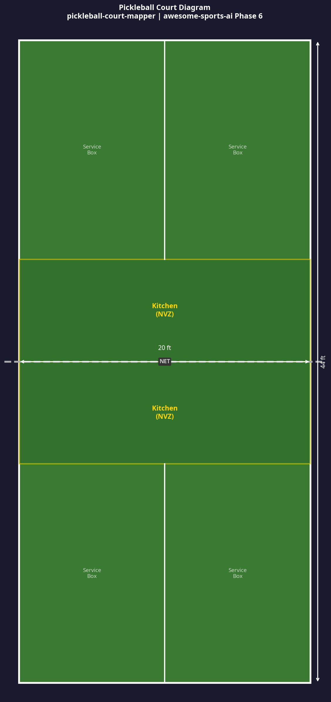

# pickleball-court-mapper

> **Phase 6 Prototype** — Part of the [Awesome Sports AI](../../README.md) 2026 Roadmap.

Detects court lines from a pickleball court image using **OpenCV Hough line transforms** and annotates the image with detected boundaries and key zones (Kitchen/NVZ, service boxes, baselines). Also generates a clean, labeled court diagram for use in analytics dashboards.

Inspired by tools like PB Vision, this mono-tool makes court geometry detection accessible to any developer with a court image.

## Enterprise Capability Decomposed

| Enterprise System | What it does | What this tool replaces |
|---|---|---|
| PB Vision / Swing.vision | Proprietary CV pipeline for court detection and ball tracking | This tool provides the court-line detection layer using open-source OpenCV |

## How It Works

1. If a `court.jpg` is provided, it is loaded. Otherwise, a synthetic court image is auto-generated.
2. The image is converted to grayscale and Canny edge detection is applied.
3. A **Hough Line Transform** detects line segments matching court boundaries.
4. The original image is annotated with detected lines in red.
5. A clean, labeled **court diagram** (PNG) is also generated for use in dashboards.

## Usage

```bash
# Install dependencies
pip install opencv-python-headless matplotlib numpy

# Run with your own court image (optional)
cp /path/to/your/court.jpg court.jpg

# Run the mapper
python3 court_mapper.py
```

## Output

- `court_annotated.png` — Original image with detected court lines overlaid in red.
- `court_diagram.png` — Clean labeled court diagram with zones and dimensions.

## Sample Output



## Extending This Tool

- Add **ball tracking** by combining with a YOLOv8 model trained on pickleball ball detection.
- Add **shot zone mapping** to visualize where shots are hit from on the court.
- Integrate with a mobile camera feed for real-time court calibration during amateur matches.

## Sports Tag

_Sports: Tennis/Racquet._
