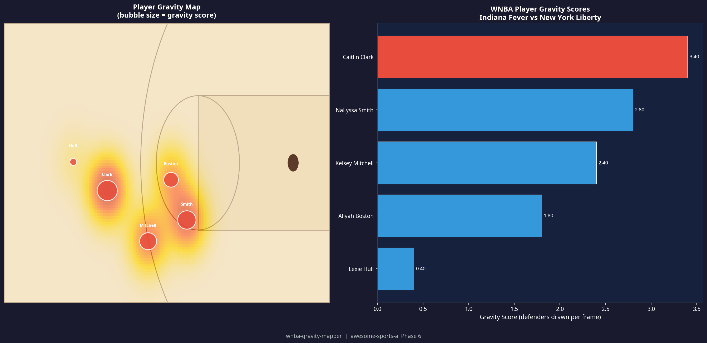

# wnba-gravity-mapper

> **Phase 6 Prototype** — Part of the [Awesome Sports AI](../../README.md) 2026 Roadmap.

Calculates a simplified **"gravity" score** for each offensive player — a measure of how much defensive attention they draw — based on player tracking coordinates. Generates a 2D half-court heatmap visualization and a ranked gravity score table.

Inspired by the advanced "Gravity" metric introduced by WNBA Inside Edge / Genius Sports in 2026, this tool makes a simplified version accessible to any developer with CSV tracking data.

## Enterprise Capability Decomposed

| Enterprise System | What it does | What this tool replaces |
|---|---|---|
| Genius Sports GeniusIQ / WNBA Inside Edge | Calculates proprietary "gravity" and spacing metrics from optical tracking data | This tool computes a proximity-based gravity score from any CSV with X,Y player coordinates |

## How It Works

1. A CSV file with per-frame player positions is loaded (`sample_tracking.csv`).
2. For each offensive player, the script counts how many defenders are within 8 feet per frame.
3. A **gravity score** is calculated as the average number of defenders drawn per frame, with a bonus multiplier when the player holds the ball.
4. A two-panel visualization is generated: a **heatmap on a half-court diagram** (bubble size = gravity score) and a **ranked bar chart**.

## Usage

```bash
# Install dependencies
pip install pandas matplotlib scipy numpy

# Run the mapper
python3 gravity_mapper.py
```

## Input Format (`sample_tracking.csv`)

```
frame,player_id,player_name,team,x,y,has_ball
1,1,Caitlin Clark,Indiana Fever,12.5,8.2,0
1,4,NaLyssa Smith,Indiana Fever,25.0,6.0,1
...
```

Coordinates are in feet on a half-court (47 ft wide × 25 ft tall).

## Output

- `gravity_map.png` — Visual heatmap and bar chart of player gravity scores.
- `gravity_scores.csv` — Ranked table of player gravity scores.

## Sample Output



## Extending This Tool

- Connect to real WNBA tracking data via the [Second Spectrum](https://www.secondspectrum.com/) or [Synergy Sports](https://synergysports.com/) APIs.
- Add time-slice filtering to analyze gravity in specific game situations (e.g., clutch time, pick-and-roll).
- Extend to NBA, FIBA, or EuroLeague data with the same coordinate format.

## Sports Tag

_Sports: Basketball._
